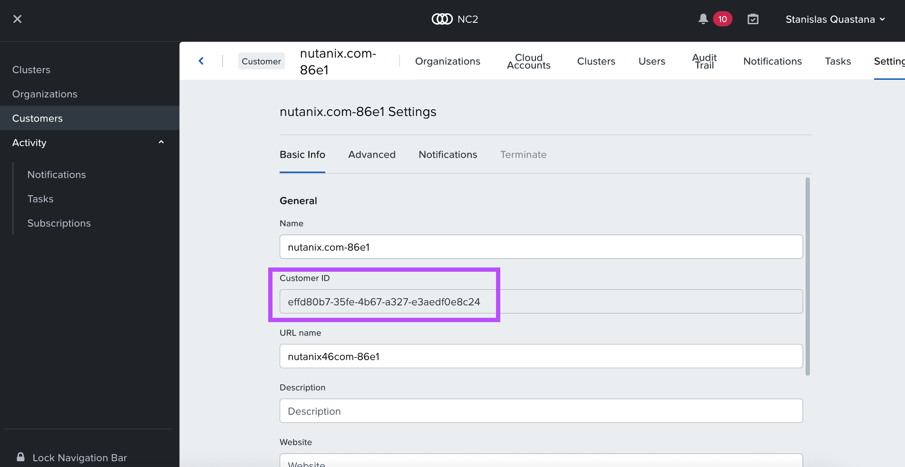

# Terraform-RolePermissions-for-NC2onAWS
A Terraform way to create, in AWS IAM, roles and permissions mandatory for Nutanix Cloud Clusters on AWS


This code is the **Terraform version of the Nutanix official CloudFormation Template** provided to set up roles and permissions required for deploying and managing Nutanix Cloud Clusters on AWS available at the following URL :
https://s3.us-east-1.amazonaws.com/prod-gcf-567c917002e610cce2ea/aws_cf_clusters_high.json and refered in Nutanix NC2 on AWS Deployment Guide available here : https://portal.nutanix.com/page/documents/details?targetId=Nutanix-Clusters-AWS:aws-clusters-aws-getting-started-c.html 

/!\ This code is **PROVIDED AS IS** without any official support of Nutanix /!\\

It can be used if you don't want to create CF Stack and prefer to use Terraform to deploy the roles and permissions


<!-- GETTING STARTED -->
## Getting Started

First clone this repo, then read the content of aws_cf_clusters_high-terraform.tf, then use terraform to deploy AWS Roles and permissions needed to create a Cloud Account in Nutanix MultiCloud Management console (aka [NC2 portal](https://cloud.nutanix.com))

### Prerequisites

You need to install [terraform](https://developer.hashicorp.com/terraform/tutorials/aws-get-started/install-cli ) (I did not test it with [opentofu](https://opentofu.org/docs/intro/install/) but it should also work)


VERY VERY VERY Important : you need to provide your Nutanix NC2 Customer ID !!!

For that, open the NC2/CM portal (https://cloud.nutanix.com), On the left part of UI click on Customers

Then click on the 3 dots at the end of the line of your customer name and click on Settings

 

 

Get the Customer ID in the URL, copy paste the value in configuration.tfvars for the gateway_external_id variable

### Deployment

  ```bash
  terraform init
  terraform plan   --var-file=configuration.tfvars
  terraform apply  --var-file=configuration.tfvars
  ```
